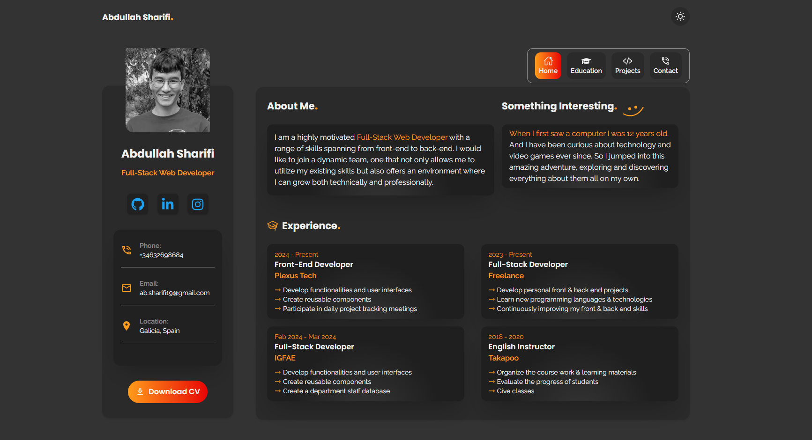

# 🌐 My Personal Website

[Demo](https://abdullah-sharifi.vercel.app/)

    

## 🤖 Design inspiration

- [Figma design](<https://www.figma.com/design/JnimM2vOsAs5zwpFFR2lvx/Portfolio-Design-(Community)?node-id=0-1&t=1sv2mEKyEFgcweA1-0>)

## Installation

1. Clone the project 👉
   `git clone git@github.com:ab-sharifi21/personal-portfolio.git`

2. Create .env file with all the variables from 👉 `.env.example`

3. Install the dependencies 👉 `npm install`

4. Run the application 👉 `npm run dev`

## Key Features

- 🔦 Dark/Light mode toggle
- 📱 Responsive design
- 🌐 Internationalization (i18n) support (English and Spanish)

## Technologies

- HTML
- Tailwind CSS
- Next.js
- TypeScript
- react-icons
- Emailjs
- next-intl
